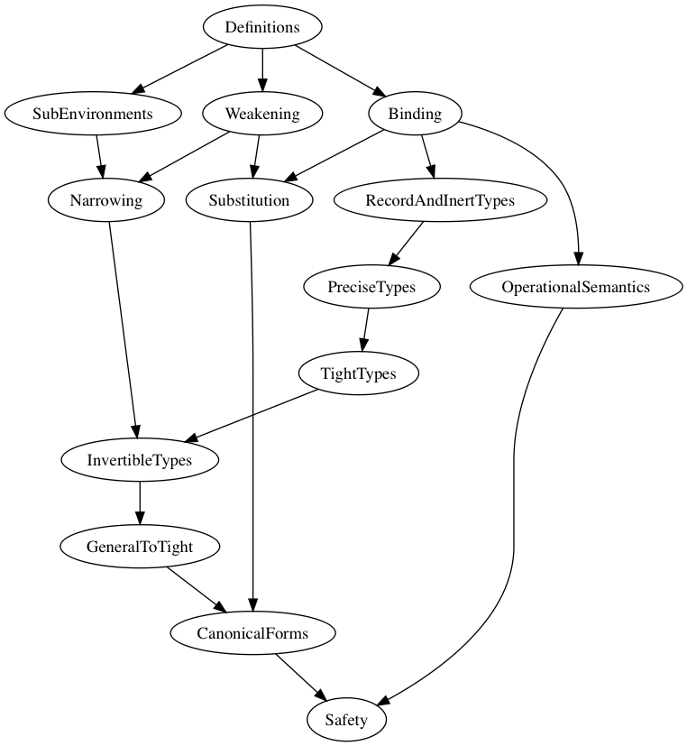

# A Simple Soundness Proof for Dependent Object Types

Our [paper](https://plg.uwaterloo.ca/~olhotak/pubs/oopsla17.pdf) presents a simplified type-safety proof for the [version of DOT](https://infoscience.epfl.ch/record/215280) presented at Wadlerfest 2016. This repository contains a formalization of the simple proof in Coq. The definitions of the abstract syntax and several lemmas are based on the [original](https://github.com/samuelgruetter/dot-calculus/blob/master/dev/lf/dot_top_bot.v) Coq proof that comes with Wadlerfest DOT paper.

### Requirements

To compile the proof, we require `coq 8.6` and related tooling to be run in a unix-like environment. In particular, we require the following tools (all version 8.6) in the `PATH` enviroment variable:
  * coqc
  * coqtop
  * coqdep
  * coqdoc
  * coqmakefile

Other requirements are:
  * make

### Instructions

#### Compiling the proof

To compile the proof, run

    git clone https://github.com/amaurremi/dot-calculus
    cd dot-calculus/src/simple-proof
    make

`make` will do the following:

- compile the `tlc` library
- compile the safety proof
- generate documentation.

#### Inspecting Source files

The documentation can be accessed from the [Table of Contents](doc/toc.html). This page lists links to pretty printed Coq source files, but the raw `.v` files can be found in the [proof](proof) directory. In the pretty-printed versions, the proof scripts are hidden by default, you may click on "Show Proofs" at the top of the page to display all the proofs, or click under the Lemma or Theorem statements to display their proofs.

## Description of the Proof

This directory contains a Coq formalization of the DOT calculus and DOT's type safety proof using the method presented in the paper. The final Progress and Preservation proofs can be found in [Safety.v](proof/Safety.v).

### Proof Structure

The Coq proof is split up into the following modules:
  * [Definitions.v](proof/Definitions.v): The main inductive definitions and functions that are used in the proof. Defines the abstract syntax and type system.
  * [Binding.v](proof/Binding.v): Proves helper lemmas related to opening, closing, and local closure.
  * [SubEnvironments.v](proof/SubEnvironments.v): Defines and proves lemmas related to subenvironments.
  * [Weakening.v](proof/Weakening.v): Proves the Weakening Lemma.
  * [RecordAndInertTypes.v](proof/RecordAndInertTypes.v): Defines and proves lemmas related to record and inert types.
  * [Narrowing.v](proof/Narrowing.v): Proves the Narrowing Lemma.
  * [OperationalSemantics.v](proof/OperationalSemantics.v): Defines normal forms and the operational semantics of DOT, as well as related helper lemmas.
  * [PreciseTypes.v](proof/PreciseTypes.v): Defines and proves lemmas related to precise typing. In particular, reasons about the possible precise types that a variable can have in an inert environment.
  * [TightTypes.v](proof/TightTypes.v): Defines tight typing and subtyping.
  * [Substitution.v](proof/Substitution.v): Proves the Substitution Lemma.
  * [InvertibleTypes.v](proof/InvertibleTypes.v): Defines invertible typing and proves that in an inert context, tight typing implies invertible typing (both for variables and values).
  * [GeneralToTight.v](proof/GeneralToTight.v): Proves that in an inert context, general typing implies tight typing.
  * [CanonicalForms.v](proof/CanonicalForms.v): Proves the Canonical Forms Lemmas for functions and objects.
  * [Safety.v](proof/Safety.v): Proves the Progress and Preservation Theorems.

The following figure shows a dependency graph between the Coq modules.

